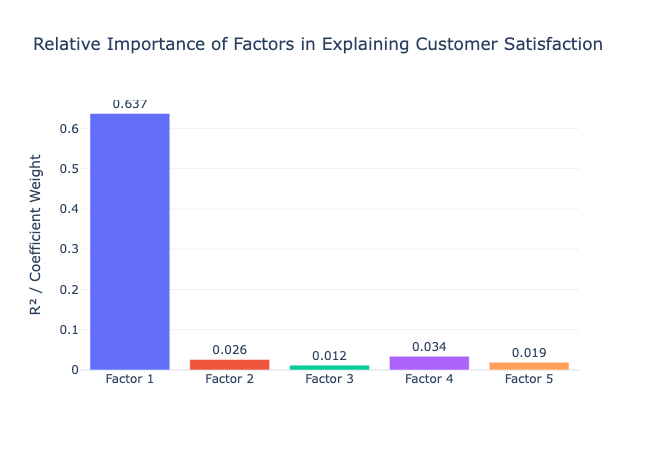

# Customer Satisfaction Analysis — README

## (Business Context)

**Client & problem description:**

The client is a B2B services firm measuring customer perceptions and commercial outcomes via a quarterly customer survey and associated business metrics. The project seeks to identify the underlying drivers of customer satisfaction and quantify their impact on key business outcomes (NPS, renewals, revenue growth, referrals).

**Strategic importance:**

Understanding latent drivers of customer satisfaction enables prioritized investments (support, delivery, product improvements, pricing transparency) to reduce churn, increase renewals and grow revenue with measurable ROI.

## (Methodology)

**Multivariate method applied:**

- Exploratory Factor Analysis (EFA) — extraction with principal method, Varimax rotation; 5-factor solution retained. Factor scores were computed and used as predictors in regression models against commercial outcomes.

**Justification of the choice:**

- EFA reduces many correlated survey items into a smaller set of interpretable latent factors, improving interpretability and avoiding multicollinearity in downstream predictive models. Regressions on factor scores provide direct, actionable effect sizes.

**Tools and libraries used:**

- Python: `pandas`, `numpy`, `scipy`, `scikit-learn`, `statsmodels`, `factor_analyzer`
- Visualization: `matplotlib`, `seaborn`, `plotly`
- Execution: `Jupyter` notebook (`costomer_satisfaction.ipynb`)

## (Data)

**Dataset description:**

- File: `customer_satisfaction_data.csv` (customer-quarter survey responses and outcome metrics). Each row is a customer observation for the quarter with ~400+ customers in Q1_2024.

**Key variables:**

- Identifiers/time: `customer_id`, `quarter`, `survey_date`
- Survey items (examples): `account_manager_responsive`, `billing_accuracy`, `communication_clarity`, `technical_expertise`, `quality_deliverables`, `support_responsiveness`, `value_for_money`, `project_management`, `timeline_adherence`, etc.
- Outcome/business metrics: `overall_satisfaction`, `nps_score`, `renewal_likelihood`, `revenue_growth_pct`, `referrals_generated`

**Link to data dictionary:**

- There is no separate data-dictionary file in the repo. Column names and basic descriptions are available in the header of `customer_satisfaction_data.csv` and in the explanatory cells of `costomer_satisfaction.ipynb`. If you want, I can auto-generate a `DATA_DICTIONARY.md` from the CSV header and add it to the repository.

## (Main Findings)

- The dataset is highly suitable for factor analysis: **Kaiser-Meyer-Olkin (KMO) = 0.959** and Bartlett’s test is significant (p < 0.05), supporting factorability.
- A 5-factor solution was retained. The five factors together explain **61.85%** of total variance; **Factor 1 alone explains ≈ 38.0%**.
- Interpretable factor labels (from rotated loadings):
  - Factor 1 — Technical Excellence & Innovation (technical_expertise, problem_solving, innovation_solutions, system_integration, technical_documentation)
  - Factor 2 — Relationship Management & Customer Trust (trust_reliability, long_term_partnership, communication_clarity)
  - Factor 3 — Perceived Value & Financial Transparency (value_for_money, cost_transparency, roi_demonstration, competitive_pricing)
  - Factor 4 — Project Execution & Delivery Performance (project_management, timeline_adherence, budget_control, quality_deliverables)
  - Factor 5 — Customer Support & Service Excellence (support_responsiveness, training_quality, documentation_help)
- Predictive modeling (regression on factor scores) shows **Factor 1 (Technical Excellence & Innovation)** is the dominant driver of `overall_satisfaction` with standardized effect **β ≈ 0.64**. The notebook reports an R² contribution vector (approx) of **[0.637, 0.026, 0.012, 0.034, 0.019]**, highlighting Factor 1’s disproportionate share of explained variance.

> Replace these numbers with alternative model runs if you perform cross-validation or alternative model specifications.

## (Featured visualization)

Figure: Relative importance / R² contribution of each factor when predicting customer satisfaction (see `visualizations/` for full set of plots: `scree_plot.png`, `factor_loadings_heatmap.png`, etc.).

## (Model performance metrics)

- Example predictive performance reported in the notebook when modelling `overall_satisfaction` with factor scores:
  - R² (example fit): ≈ **0.64**
  - RMSE: models in the notebook reported RMSE generally **below 0.55**
  - The notebook includes a `predictive_results` DataFrame with per-outcome coefficient and performance rows; consider exporting it to CSV for stakeholder review.

## (Business recommendations)

1. Strengthen Technical Excellence & Innovation (Factor 1): invest in technical training, code/release quality checks, and richer technical documentation — expected impact: increase `overall_satisfaction`, renewal likelihood, and revenue growth.
2. Improve Project Delivery (Factor 4): standardize delivery processes (Agile/PMO), track timeline and budget KPIs, and fix billing accuracy issues for mid-sized accounts — expected impact: reduce complaints, improve renewals.
3. Increase Financial Transparency & Value Communication (Factor 3): provide ROI summaries and clearer pricing communication for clients, and pilot packaging/value offers — expected impact: higher NPS and more referrals.

For each recommendation, run a small pilot (A/B test or targeted segment rollout) and track `overall_satisfaction`, `renewal_likelihood`, and revenue metrics before scaling.

## (Expected impact)

- Short term (1–3 months): operational fixes (billing, SLA clarifications) should reduce complaint volume and raise satisfaction scores modestly.
- Medium term (3–9 months): investments in technical capability and delivery process should materially increase satisfaction and renewal rates.
- Long term (>9 months): improved value communication and product enhancements should drive referral growth and sustainable revenue increases.

## (Next steps)

1. Export the notebook's `predictive_results` to `artifacts/predictive_results.csv` and attach a coefficients table for each outcome to the README (I can do this for you).
2. Add a formal `DATA_DICTIONARY.md` generated from `customer_satisfaction_data.csv` (optional but recommended).
3. Design 2 pilot interventions (one operational, one technical) with clear success metrics and a 3-month timeline.
