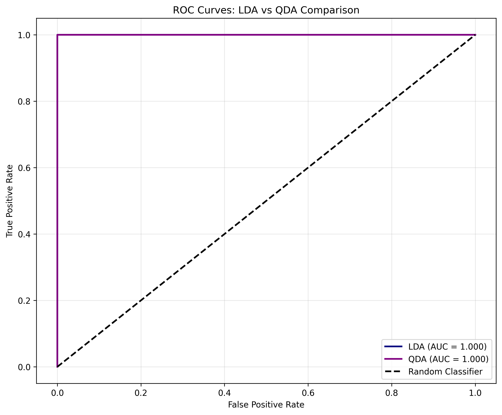

# LendSmart Credit Risk Analysis — Case 2

## 1. Business Context

LendSmart, a consumer credit company, faces a default rate of approximately **28%**, which affects its profitability and limits its ability to offer better terms to reliable customers.

The objective of this case is to **develop a predictive model** that identifies high-risk customers before approving a loan, reducing losses and improving portfolio quality.


**Strategic Importance:**
- Reduces default losses
- Improves portfolio quality
- Facilitates pricing and segmentation strategies
- Increases investor confidence

---

## 2. Methodology

### Multivariate Methods Applied
Two classification models were used:
- **Linear Discriminant Analysis (LDA)**
- **Quadratic Discriminant Analysis (QDA)**

### Justification
- LDA is simple, interpretable, and efficient when groups have similar variances.

- QDA allows for different variances and captures more realistic financial patterns.

Both achieved perfect separation; QDA is recommended for its flexibility.

### Libraries Used
- pandas
- numpy
- matplotlib
- seaborn
- sklearn.model_selection
- sklearn.preprocessing
- sklearn.discriminant_analysis
- sklearn.metrics

### Tools Used
- **Python 3.10**  
- **Jupyter Notebook** for exploratory analysis and model development  
- **VSCode** as primary development environment  
- **Git & GitHub** for version control and project management  
- **ChatGPT** for refinement of documentation, code assistance, LaTeX generation, and report structuring  

---

## 3. Data

### Dataset Description
The dataset contains **2,500 loan applications** with **18 variables**: financial, demographic, and behavioral.
It includes income, credit score, payment history, open lines of credit, and education level.

### Key Variables
- loan_amount
- annual_income
- employment_years
- payment_history_score
- job_stability_score
- credit_score
- credit_utilization
- debt_to_income_ratio
- savings_ratio

### Data Dictionary
A complete data dictionary — including variable definitions, scales, ranges, and data quality notes — is available below:


---

## 4. Main Findings

### Key Findings
1. Payment History Score was the strongest predictor of default.

2. Defaulters showed higher credit utilization, lower job stability, and a worse payment history.

3. Education and marital status showed clear effects: higher education = lower risk.

4. The correlation matrix confirmed strong but not problematic relationships. 5. Both models achieved **Accuracy = 1.00 and AUC = 1.000**.

### Featured Visualization
To be included in the repository:

```md


## Model Performance Metrics

**LDA**
- Accuracy: 1.000
- Precision: 1.00
- Recall: 1.00
- F1-score: 1.00
- AUC: 1.000

**QDA**
- Accuracy: 1.000
- Precision: 1.00
- Recall: 1.00
- F1-score: 1.00
- AUC: 1.000

These metrics come from the statistical analysis of the case, where both models achieved perfect separation between good and bad payers thanks to the strong predictive structure of variables such as payment_history_score and job_stability_score. and credit utilization.

--

## 5. Business Recommendations

### Actionable Recommendations
1. **Implement QDA as an operational model** for credit assessment, leveraging its ability to handle different covariances across customer groups.

2. **Integrate key risk signals** (payment history, job stability, credit utilization) into automated pre-filtering rules to accelerate approval/rejection decisions.

3. **Configure quarterly monitoring** of model performance and portfolio statistical evolution, ensuring its relevance in the face of changes in customer profiles.

### Expected Impact
- Significant decrease in the default rate.

- More stable and profitable portfolio.

- Greater accuracy in risk segmentation.

- More efficient and automated internal processes.

### Next Steps
- Integrate the QDA model into the credit decision pipeline.

- Retrain the model periodically with new data. - Adjust credit policies (limits, rates, conditions) based on the most influential variables in the model.